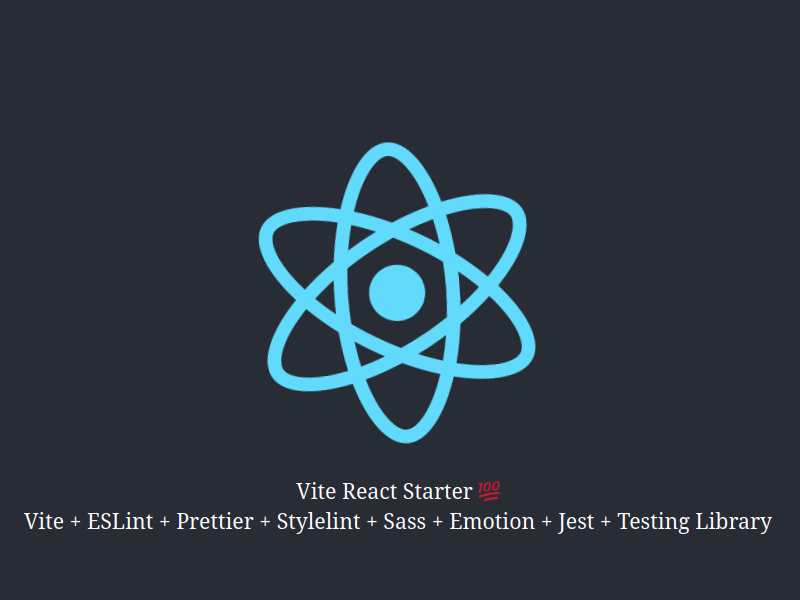

# Vite React Starter

> Opinionated Vite starter template.

## Description

An starter template for Vite React 18 projects including a bunch of useful tools and libraries enforcing best practices and autofix on save.

For styling it comes with SASS, Emotion, and TailwindCSS ready to use. Choose your favorite CSS framework and get started. It also includes the @namics/stylelint-bem plugin for BEM style validation.

## Built With

- [Vite](https://vitejs.dev/) Next generation frontend tooling.
- [Babel](https://babeljs.io/) The compiler for next generation JavaScript.
- [React Router](https://reactrouter.com/) Declarative Routing for React.js
- [ESLint](https://eslint.org/) Find and fix problems in your JavaScript code.
- [Prettier](https://prettier.io/) Opinionated code formatter.
- [Stylelint](https://stylelint.io/) A mighty, modern linter that helps you avoid errors and enforce conventions in your styles.
- [@emotion/react](https://emotion.sh/) Emotion is a library designed for writing css styles with JavaScript.
- [@emotion/styled](https://emotion.sh/) Styled is a way to create React components that have styles attached to them.
- [Sass](https://sass-lang.com/) Syntactically Awesome Style Sheets.
- [TailwindCSS](https://tailwindcss.com/) Rapidly build modern websites without ever leaving your HTML.
- [Jest](https://jestjs.io/) Delightful JavaScript Testing.
- [Testing Library](https://testing-library.com/) The React Testing Library is a very light-weight solution for testing React components

### Other Plugins

- [prop-types](https://www.npmjs.com/package/prop-types) Runtime type checking for React props and similar objects.
- [react-error-boundary](https://www.npmjs.com/package/react-error-boundary) Simple reusable React error boundary component.
- [eslint-config-airbnb](https://www.npmjs.com/package/eslint-config-airbnb) Airbnb's extensible shared config.
- [eslint-plugin-import](https://www.npmjs.com/package/eslint-plugin-import) Linting support of ES2015+ (ES6+) import/export syntax.
- [eslint-plugin-jsx-a11y](https://www.npmjs.com/package/eslint-plugin-jsx-a11y) Enforce accessibility best practices for React components.
- [eslint-plugin-unused-imports](https://www.npmjs.com/package/eslint-plugin-unused-imports) Report and remove unused es6 modules.
- [postcss](https://www.npmjs.com/package/postcss) PostCSS is a tool for transforming CSS with JavaScript plugins.
- [stylelint-config-idiomatic-order](https://www.npmjs.com/package/stylelint-config-idiomatic-order) Order your styles based on idiomatic-css.

## Getting Started

To get a local copy up and running follow these simple example steps.

### Prerequisites

- Recommended `node` : `>=16.13.0`
- `npm` or `pnpm` or `yarn`

I advice to use `pnpm` for managing dependencies. It's faster and more reliable than `npm`. To install [pnpm](https://pnpm.io/) just run:

- `corepack enable`
- `corepack prepare pnpm@7.0.0-rc.3 --activate`

After that the syntax is the same as `npm` e.g. `npm install` becomes `pnpm install`.

### Setup

1. Download or fork this project
2. Extract the content to a new directory, rename it and cd the directory.
3. Install all dependencies using:

- `npm install` or `pnpm install` or `yarn`

## Scripts

### Start dev server

- `npm run dev` or `pnpm run dev` or `yarn run dev` and open the browser at `http://localhost:3000`

### Build for production

- `npm run build` or `pnpm run build` or `yarn run build`

### Locally preview production build

After creating the production build, run:

- `npm run preview` or `yarn run preview`

### Start server

- `npm run serve` or `pnpm run serve` or `yarn run serve` and open the browser at `http://localhost:4173`

## Connect With Me

<!-- 👤 **Fabricio** -->

| &nbsp;       | &nbsp;                                               |
| ------------ | ---------------------------------------------------- |
| **GitHub**   | [@fabri4c](https://github.com/fabri4c)           |
| **Twitter**  | [@fabri_4c](https://twitter.com/fabri_4c)          |
| **LinkedIn** | [@fabri4c](https://www.linkedin.com/in/fabri4c/) |

## Show your support

You can give a ⭐️ if you like this project!

## Acknowledgments

The ideas and inspiration from this project are coming from the following:

- [ESLint docs](https://eslint.org/docs/user-guide/configuring/)
- [Prettier docs](https://prettier.io/docs/en/index.html)
- [Stylelint docs](https://stylelint.io/user-guide/configure/)
- [starter-vite-react](https://github.com/warugaki-web-developer/starter-vite-react)
- [Vitamin](https://github.com/wtchnm/Vitamin)

## License

No License. You can use this starter as you wish.
